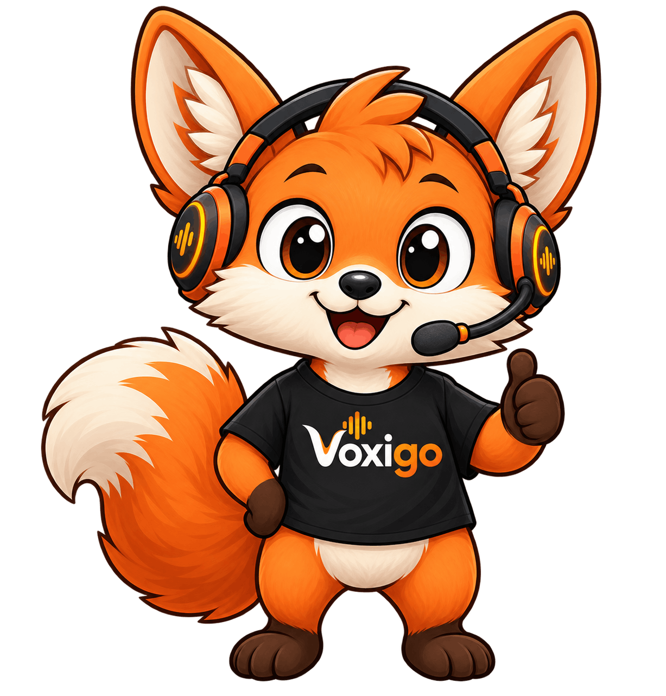

<div align="center">



**A WebRTC-native, audio-first conversational-AI framework for Go.**

[](https://github.com/gojargo/jargo/actions/workflows/ci.yml)
[](https://pkg.go.dev/github.com/gojargo/jargo)
[](https://securityscorecards.dev/viewer/?uri=github.com/gojargo/jargo)

[](https://github.com/gojargo/jargo/releases)
[](LICENSE)
[](#project-status)

</div>

---

**jargo** is a framework for real-time voice agents in Go: audio in over WebRTC,
a streaming transcription → reasoning → speech pipeline with turn-taking and
barge-in, and audio back out.

> [!WARNING]
> **Early work in progress. Not ready for production.** The public API is
> unstable and changes in any release. See [Project status](#project-status).

## Why?

[Pipecat](https://github.com/pipecat-ai/pipecat) is great, and jargo is a port of
it. The architecture and many design decisions are Pipecat's.

### Python might not be the way

This port exists for one reason: I'd rather not run a voice agent on Python.

Python is the right tool when you need the AI/data-science ecosystem. A
real-time voice *server* doesn't: the models run as services or as ONNX, and
what's left is plumbing: audio framing, WebRTC, concurrency, and shipping a
binary. For that, Go is a better fit: one static binary to deploy, low and
predictable memory, fast startup, and real concurrency for many simultaneous
sessions without a GIL. The heavy numerics stay where they belong (the ONNX
Runtime, the remote services), so giving up Python costs little here. See the
[benchmarks](https://github.com/gojargo/jargo-benchmarks) for the honest performance picture.

### No Daily, no lock-in

jargo stays on plain, standard WebRTC via [Pion](https://github.com/pion): no
Daily, no hosted transport, no proprietary SDK or cloud to sign up for. You ship
one binary, the browser connects with vanilla WebRTC, and RTVI rides the data
channel. Keeping the transport open and self-hosted is a deliberate goal, not an
afterthought.

## Features

- **WebRTC**, pure Go ([Pion](https://github.com/pion)): audio in and out of the browser.
- **Opus**, pure Go encode + decode via [pion/opus](https://github.com/pion/opus); C libopus optional with `-tags libopus`.
- **Resampling**, pure Go via [go-resample](https://github.com/gojargo/go-resample); libsoxr optional with `-tags libsoxr`.
- **Streaming voice pipeline**: STT → LLM → TTS, with prompt caching.
- **Speech-to-speech**: single-model voice agents (OpenAI Realtime, Gemini Live, AWS Nova Sonic).
- **Turn-taking & barge-in**: Silero VAD + Smart Turn v3, local ONNX.
- **Telephony** (optional): inbound/outbound phone calls over Twilio Media Streams.
- **User-idle watchdog**: re-engage or hang up when the caller goes silent.
- **RTVI** data channel: works with existing RTVI clients.
- **Pluggable services**: swap any STT/LLM/TTS behind a small interface.
- **Concurrent by design**: independent processors; interruptions are frames.

## Providers

Pick any per category; each is a small `Config` + constructor.

- **STT**: Deepgram, AssemblyAI, Gladia, Speechmatics, Soniox, Whisper (OpenAI/Groq/local), Azure, xAI, ElevenLabs, Cartesia, NVIDIA.
- **LLM**: Anthropic (direct + Bedrock), OpenAI (chat + Responses), Google Gemini (direct + Vertex), Groq, Together, Fireworks, DeepSeek,
  Cerebras, Perplexity, OpenRouter, xAI, Ollama, NVIDIA, Mistral, Nebius, SambaNova, Qwen, Azure OpenAI.
- **TTS**: ElevenLabs, Cartesia, Rime, LMNT, Kokoro, Piper, Deepgram, OpenAI, Azure, Hume, Fish, MiniMax, xAI, NVIDIA, Soniox.
- **Speech-to-speech**: OpenAI Realtime (direct + Azure), Gemini Live (direct + Vertex), AWS Nova Sonic, xAI Realtime.
- **Memory**: mem0.

## Dependencies

The default build is **cgo-free**: `CGO_ENABLED=0 go build ./...` works with no C
toolchain. Two native runtimes are still used, but bound through
[purego](https://github.com/ebitengine/purego) and loaded at run time, so they need
their shared library present at runtime and nothing at build time:

- **ONNX Runtime**: VAD + end-of-turn detection (`JARGO_ONNXRUNTIME_LIB`).
- **RNNoise**: optional input noise reduction (`JARGO_RNNOISE_LIB`).

Opus and resampling are pure Go by default; the C libopus (`-tags libopus`) and
libsoxr (`-tags libsoxr`) are the only cgo in the tree, and both are optional. The
[base images](docs/deploy/docker.md) bundle all of them.

## Usage

```sh
go get github.com/gojargo/jargo
```

A bot is an STT → LLM → TTS pipeline over a WebRTC transport. The heart of it:

```go
stt := chat.NewSTT(chat.STTConfig{APIKey: key, SampleRate: opus.SampleRate})
llm := chat.NewLLM(chat.LLMConfig{APIKey: key})
tts := chat.NewTTS(chat.TTSConfig{APIKey: key})

t := pionrtc.NewTransport(conn, transport.DefaultParams())
agg := aggregators.New(frames.NewLLMContext("You are a helpful voice assistant."))

task := pipeline.NewTask(pipeline.New(
	t.Input(), stt, agg.User(), llm, tts, t.Output(), agg.Assistant(),
), pipeline.TaskParams{})
task.Run(ctx)
```

[`examples/voice/openai`](examples/voice/openai) is that pipeline as a complete
server (WebRTC signaling, VAD/turn-taking, barge-in).

**Run it in Docker**: build on the `gojargo/jargo-build` base and ship on the
distroless `gojargo/jargo` runtime (it bundles the ONNX Runtime), then:

```sh
docker run --rm -p 8080:8080 -e OPENAI_API_KEY=$OPENAI_API_KEY my-bot
```

See **[Deploy with Docker](docs/deploy/docker.md)** for the Dockerfile and
the **[Quickstart](docs/getting-started/quickstart.md)** for the full setup.

## Examples

Runnable bots live in [`examples/`](examples):

- **echo**: hear yourself back, no API keys.
- **voicebot**: the full voice agent (STT → LLM → TTS over WebRTC) with
  turn-taking, long-term memory, and tracing.
- **voice/**: one headless backend per provider, each wiring its STT/LLM/TTS
  explicitly and exposing the WebRTC `/offer` endpoint (no web UI). Run with
  `go run ./examples/voice/<provider>` (e.g. `deepgram`, `cartesia`, `openai`)
  and drive it from a browser client, the `nextjs-voicebot` in
  [jargo-client-react](https://github.com/gojargo/jargo-client-react).
- **twiliobot**: a phone agent over Twilio Media Streams, with the idle watchdog.

The fastest way to try them (locally or with Docker) is the
**[Quickstart](docs/getting-started/quickstart.md)**.

```sh
go run ./examples/echo                 # then open http://localhost:8080
```

## Documentation

**[gojargo.github.io/jargo](https://gojargo.github.io/jargo/)** is the full
documentation. The same pages live in [`docs/`](docs) and read fine on GitHub.

Start with [Architecture](docs/concepts/architecture.md) for the model, or
[Frames](docs/concepts/frames.md) and [Processors](docs/concepts/processors.md) for
the engine. [Writing a processor](docs/extending/custom-processor.md) covers
extending it. The API reference is the
[Go reference](https://pkg.go.dev/github.com/gojargo/jargo).

## Project status

jargo is **early work in progress**, in the `0.0.x` series. It runs real
conversations end to end, but it has not been hardened by production use.

What that means in practice:

- **The API will break.** Anything exported may be renamed, resliced or removed
  in any release, with no deprecation period. Pin an exact version and read
  [`CHANGELOG.md`](CHANGELOG.md) before upgrading.
- **Coverage is uneven.** The core pipeline, WebRTC transport and turn-taking get
  the most use; some of the 50+ providers are thinly exercised. Bug reports about
  a specific provider are especially useful.
- **What is not settled yet:** the frame catalog is still growing, and several
  subsystems that exist upstream are not ported yet, including images and vision.

Issues and pull requests are welcome, particularly ones that come with a failing
test.

## License & attribution

jargo is a Go port of [Pipecat](https://github.com/pipecat-ai/pipecat),
distributed under the same **BSD 2-Clause License**. The upstream copyright
(*Copyright (c) 2024–2026, Daily*) is preserved verbatim in [`LICENSE`](LICENSE);
see [`NOTICE`](NOTICE) for details. jargo is an independent project, not
affiliated with or endorsed by Daily.
