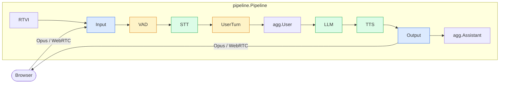
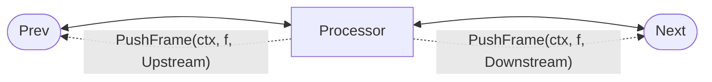
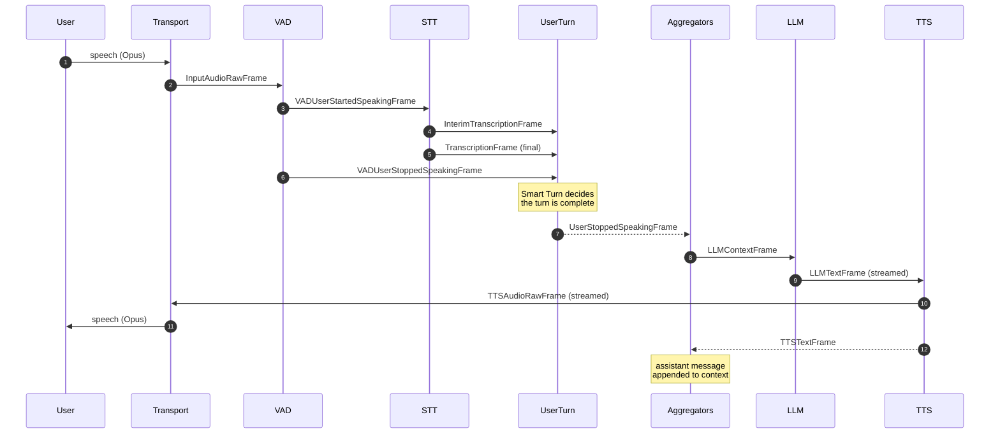

# Architecture

A jargo bot is a **chain of processors** that passes **frames** to each other.
Audio arrives from a transport at one end, text and audio flow through the
services in the middle, and synthesized speech leaves through the same transport
at the other end.

That is the whole model. Everything else in this section is detail about those
two nouns.

## The shape of a bot

Here is a complete voice agent: the pipeline from
[`examples/voice/openai`](https://github.com/gojargo/jargo/tree/main/examples/voice/openai),
which is the reference wiring:



In code, that diagram is a slice:

```go
procs := []processor.Processor{
    rtvi.NewProcessor(), t.Input(), vadProc, stt, turnsProc,
    agg.User(), llm, tts, t.Output(), agg.Assistant(),
}
task := pipeline.NewWorker(pipeline.New(procs...), pipeline.WorkerConfig{})
task.Run(ctx)
```

Two things about that order are worth noticing now, because they explain most of
the design:

- **The assistant aggregator sits *after* the output transport.** It records what
  the bot actually said into the conversation context, so it has to be positioned
  where the spoken text has already gone out.
- **`UserTurn` sits after STT, not next to the VAD.** It decides when the user's
  turn is over, and that decision needs transcriptions and LLM/TTS activity, not
  just raw speech energy. It reaches the processors *behind* it by pushing frames
  upstream.
- **The RTVI processor sits at the very top, ahead of the input transport.** What
  the client injects (a typed message, a keypress) is pushed downstream from
  there, so it travels the pipeline by the same path a real caller's speech
  takes. Its messages back to the client travel downstream too, and reach the
  output transport at the far end.

## Frames flow both ways

A processor has two neighbors and can push to either:



**Downstream** is input → output: audio, transcriptions, LLM text, speech.
**Upstream** is output → input: errors, metrics, and the turn-taking signals that
have to reach processors positioned earlier in the chain.

This is why interruptions work at all. When the user barges in, `UserTurn` emits
an `InterruptionFrame` in *both* directions, so every processor in the chain
(those ahead of it and those behind it) learns about it at once. See
[Interruptions](interruptions.md).

## The three layers

| Layer | Packages | What it does |
|---|---|---|
| **Engine** | `frames/`, `processor/`, `pipeline/` | Moves frames between processors, in order, with priority and cancellation. Knows nothing about audio or LLMs. |
| **Transports** | `transport/` | Gets audio in and out: Pion WebRTC, LiveKit, WebSocket, Twilio, local audio. |
| **Services** | `service/`, `provider/` | STT, LLM, TTS, and speech-to-speech behind small interfaces, with 50+ provider implementations. |

The engine is the part worth understanding deeply, because everything else is a
processor plugged into it. It is also small: `frames`, `processor` and `pipeline`
together are about 2,000 lines.

Around those three sit the supporting packages: `audio/` (Opus, resampling,
mixing, VAD, turn detection), `processor/aggregators` (the conversation context),
`processor/turns` (turn-taking and the idle watchdog), `observers/` and
`telemetry/` (metrics and tracing).

## A turn, end to end

What actually happens when someone speaks:



The important property: **nothing here blocks on a complete result.** STT emits
interim transcriptions while the user is still talking, the LLM streams tokens,
and TTS starts synthesizing on the first sentence boundary rather than waiting
for the full response. Latency is the sum of the first chunks, not the sum of the
complete steps.

## Where to go next

- **[Frames](frames.md)**: the three categories, and what the 62 frame types are for.
- **[Processors](processors.md)**: the two goroutines inside every processor.
- **[Pipeline & Task](pipeline.md)**: how the chain is built and driven.
- **[Interruptions](interruptions.md)**: barge-in, and why it is a frame.
- **[LLM context](llm-context.md)**: how the conversation accumulates.
