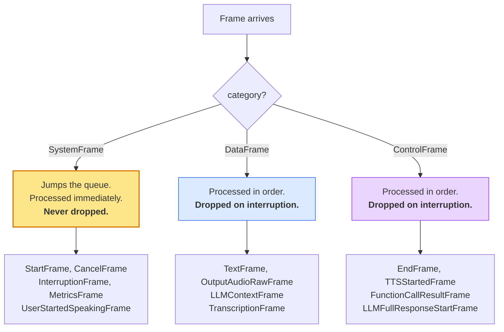
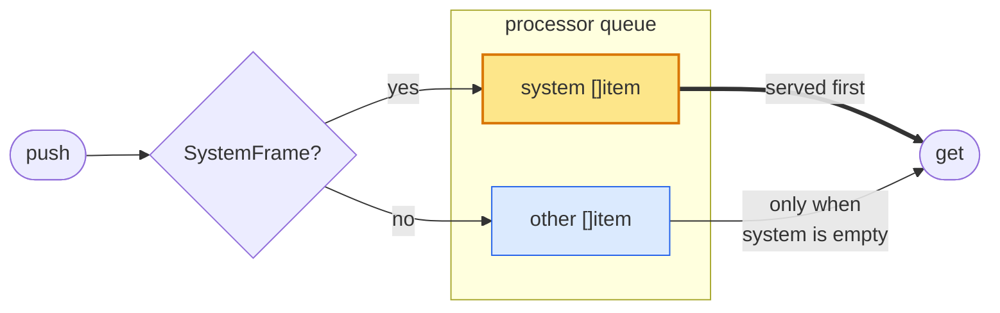

# Frames

A frame is the unit of everything that moves through a pipeline: a chunk of
audio, a transcription, an LLM token, a request to stop talking. Processors do
not call each other; they push frames.

Every frame satisfies [`frames.Frame`](https://pkg.go.dev/github.com/gojargo/jargo/frames#Frame),
which is deliberately tiny:

```go
type Frame interface {
    fmt.Stringer
    ID() uint64          // process-unique
    Name() string        // "TextFrame#42"
    Base() *BaseFrame    // optional per-frame state
    isFrame()
}
```

Identity is all the pipeline needs to route, log and correlate. The optional
state (presentation timestamp, metadata, transport source/destination) lives on
`BaseFrame` and is reached through `Base()`.

## The three categories

Category is the single most important property of a frame. It decides **when the
frame is processed** and **whether an interruption may drop it**.



A frame joins a category by **embedding** the matching base:

```go
type MyFrame struct {
    frames.BaseDataFrame       // or BaseSystemFrame / BaseControlFrame
    Payload string
}

func NewMyFrame(p string) *MyFrame {
    return &MyFrame{BaseDataFrame: frames.NewBaseDataFrame("MyFrame"), Payload: p}
}
```

Test a category by asserting the interface:

```go
if _, ok := f.(frames.SystemFrame); ok {
    // handled ahead of queued work
}
```

The difference between data and control is intent, not mechanics: both are
processed in order and both are dropped by an interruption. A **data** frame
carries payload; a **control** frame carries instruction. Treat the split as
documentation.

### The `Uninterruptible` escape hatch

Some work must complete even when the user barges in: a tool call that charges a
card, say. Embed `UninterruptibleMixin` alongside a data or control base:

```go
type ChargeResultFrame struct {
    frames.BaseControlFrame
    frames.UninterruptibleMixin
    OrderID string
}
```

An uninterruptible frame **stays queued** through an interruption, and if it is
the frame currently being processed, the processor is not canceled; it is left
to finish. `FunctionCallResultFrame` uses this.

## How priority actually works

Each processor owns two queues, and both of them serve system frames first. The
queue is unbounded and never blocks a producer, which is what keeps two
processors pushing at each other from deadlocking.



On an interruption, `reset()` drops everything in `other` **except**
uninterruptible frames. `system` is untouched.

## The catalog

There are 62 concrete frame types. Grouped by where they appear in a conversation
rather than by the file they live in.

Categories below are the real ones, taken from the embedded base. A few are worth
a second look, because the mechanical consequence is not always what the name
suggests.

### Lifecycle

| Frame | Category | Purpose |
|---|---|---|
| `StartFrame` | system | First frame down the pipeline. Carries sample rates and metrics flags; every processor initializes on it. |
| `EndFrame` | control | Graceful shutdown once queued frames have flushed. |
| `StopFrame` | control | Stop, but leave processors running and reusable. |
| `CancelFrame` | system | Stop now, without flushing. |
| `ErrorFrame` / `FatalErrorFrame` | system | Pushed upstream. A fatal one cancels the task. |
| `PipelineFlushFrame` | control | A probe that reports when the pipeline has drained. |

Note the asymmetry: `EndFrame` is **control** so it queues behind pending work and
lets it flush, while `CancelFrame` is **system** so it overtakes everything. That
is the entire difference between the two.

### Worker frames

Any processor can ask the `Task` itself to do something, by pushing one of these.
They travel to the pipeline edge and are converted into the pipeline-wide frame
above.

| Frame | Category | Becomes |
|---|---|---|
| `EndWorkerFrame` | control | `EndFrame` |
| `StopWorkerFrame` | control | `StopFrame` |
| `CancelWorkerFrame` | system | `CancelFrame` |
| `InterruptionWorkerFrame` | system | `InterruptionFrame` |

Each mirrors the category of the frame it becomes, so the "flush first" versus
"stop now" distinction holds on the way to the edge as well.

### Audio

| Frame | Category | Purpose |
|---|---|---|
| `InputAudioRawFrame` | **system** | PCM from an input transport. |
| `OutputAudioRawFrame` | data | PCM for an output transport to play. |
| `TTSAudioRawFrame` | data | PCM produced by a TTS service. |

Input audio is a **system** frame, which surprises people. It has to be: if
incoming audio were droppable, a barge-in would discard the very speech that
caused it, and the VAD would go deaf at the moment it matters most. Output audio
is data precisely so that it *can* be thrown away.

### Turn-taking

| Frame | Category | Purpose |
|---|---|---|
| `VADUserStartedSpeakingFrame` / `VADUserStoppedSpeakingFrame` | system | Raw voice-activity detection. |
| `UserStartedSpeakingFrame` / `UserStoppedSpeakingFrame` | system | The *decision* that a turn began or ended. |
| `BotStartedSpeakingFrame` / `BotStoppedSpeakingFrame` | system | Bot speech boundaries. |
| `UserSpeakingFrame` / `BotSpeakingFrame` | system | Periodic heartbeat while speech is in progress. |
| `InterruptionFrame` | system | Barge-in. See [Interruptions](interruptions.md). |
| `UserMuteStartedFrame` / `UserMuteStoppedFrame` | system | Input suppression, e.g. while the bot speaks. |
| `UserIdleTimeoutUpdateFrame` | system | Retune the idle watchdog at runtime. |
| `SpeechControlParamsFrame` | system | Broadcast the active end-of-turn timing. |
| `UserTurnInferenceCompletedFrame` | control | An external judge finished ruling on the turn. |
| `LLMMarkerFrame` | data | A turn-completion marker the LLM emitted. |

### Text and transcription

| Frame | Category | Purpose |
|---|---|---|
| `TextFrame` | data | Generic text chunk. |
| `LLMTextFrame` | data | Text streamed out of an LLM. |
| `TTSTextFrame` | data | Text a TTS service is speaking, aligned to audio. |
| `TTSSpeakFrame` | data | Fixed text to speak directly, bypassing the LLM. |
| `TranscriptionFrame` | data | Finalized user transcription. |
| `InterimTranscriptionFrame` | data | Partial, non-final transcription. |

### LLM and context

| Frame | Category | Purpose |
|---|---|---|
| `LLMContextFrame` | data | Hands the conversation to the LLM service. |
| `LLMRunFrame` | data | Run the current context now. |
| `LLMFullResponseStartFrame` / `LLMFullResponseEndFrame` | control | Bracket a streamed response. |
| `LLMMessagesAppendFrame` | control | Append messages. |
| `LLMMessagesUpdateFrame` | data | Replace all messages. |
| `LLMSetToolsFrame` / `LLMSetToolChoiceFrame` | data | Change the advertised tools at runtime. |

The tool and message frames are **data**, not control, even though they read like
instructions. That is deliberate: they are applied to the shared context and
forwarded downstream so realtime services learn of the change, and being data
means an interruption discards a pending change rather than applying it to a
conversation that has already moved on.

### Tool calls

Every tool-call frame is a **control** frame, so the whole round trip stays
ordered against the response it belongs to.

| Frame | Category | Purpose |
|---|---|---|
| `FunctionCallsStartedFrame` | control | The model requested one or more tools. |
| `FunctionCallInProgressFrame` | control | A specific call started. |
| `FunctionCallResultFrame` | control | The result. **Uninterruptible.** |
| `FunctionCallCancelFrame` | control | The call was canceled. |

### TTS

| Frame | Category | Purpose |
|---|---|---|
| `TTSStartedFrame` / `TTSStoppedFrame` | control | Bracket a synthesis run. |

### Transport, DTMF, mixing, recording

| Frame | Category | Purpose |
|---|---|---|
| `InputTransportMessageFrame` | system | An app message arrived (e.g. over the RTVI data channel). |
| `OutputTransportMessageFrame` | data | An app message to send. |
| `OutputTransportMessageUrgentFrame` | system | Same, but ahead of queued audio. |
| `InputDTMFFrame` | system | A telephony keypress arrived. |
| `OutputDTMFFrame` | control | Play a DTMF tone. |
| `MixerUpdateSettingsFrame` / `MixerEnableFrame` | control | Drive an output transport's audio mixer. |
| `AudioBufferStartRecordingFrame` / `AudioBufferStopRecordingFrame` | control | Start and stop recording. |

### Metadata and metrics

| Frame | Category | Purpose |
|---|---|---|
| `ServiceMetadataFrame` | system | A service announces itself at start. |
| `LLMServiceMetadataFrame` / `STTMetadataFrame` | system | Per-category service details. |
| `MetricsFrame` | system | TTFB, processing time, token usage. |

## Ownership: one goroutine at a time

Frames carry mutable state behind pointer receivers and are **not
synchronized**. The rule:

> A processor may read and mutate a frame until it pushes it onward, and must not
> touch it afterwards.

Pushing the same frame in both directions is a bug: the two ends run on separate
goroutines. Where a component genuinely needs to signal both ways, it builds
**two** frames and pairs them with `BroadcastSiblingID`, so a consumer can
recognize the pair and count the event once. `processor/turns` does exactly this;
`observers/` uses the sibling id to deduplicate.

`LLMContext` is the deliberate exception: it is a long-lived shared aggregate,
not a frame, and it is safe for concurrent use.

---

Next: **[Processors](processors.md)**, on what happens to a frame after it is
pushed.
