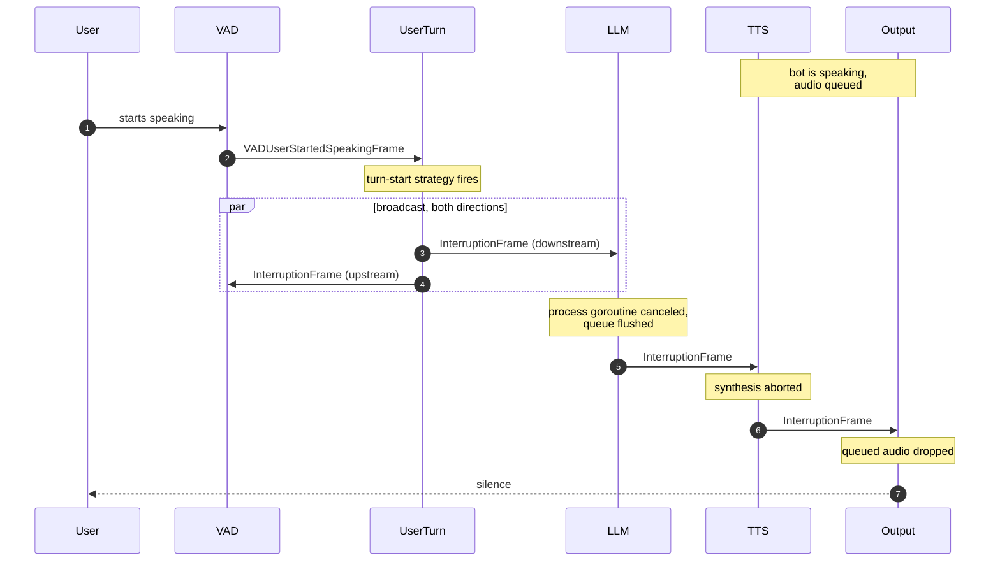
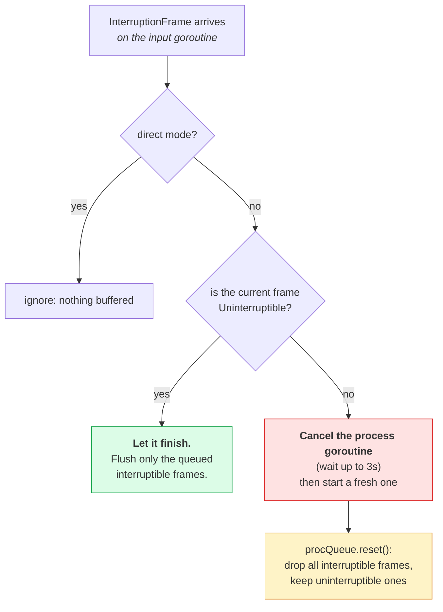

# Interruptions

When the user starts talking over the bot, the bot has to stop: immediately, and
including audio that has already been synthesized and queued. This is barge-in,
and in jargo it is not a special code path. It is a frame.

## Why a frame

A bot mid-sentence has work in flight everywhere at once: the LLM is streaming
tokens, TTS is synthesizing, the output transport has buffered audio, and the
aggregator is holding a half-built assistant message. Stopping means reaching all
of them.

Doing that with method calls would mean every component holding references to
every other. Instead, `InterruptionFrame` is a **system frame**, so it overtakes
every queue it meets, and it is **broadcast in both directions**, so it reaches
processors ahead of *and* behind its origin.

## What happens



Inside each processor, `Base.ProcessFrame` sees the `InterruptionFrame` and calls
`startInterruption()`:



Three details in there carry real weight:

- **The process goroutine is disposable.** Interruption cancels its context and
  starts a new one. Whatever it was doing is abandoned, which is why work that
  must not be abandoned needs the uninterruptible marker.
- **Cancellation is bounded at 3 seconds.** If a `ProcessFrame` implementation
  ignores `ctx`, the pipeline logs a warning and moves on rather than hanging.
  Honor `ctx` in anything slow.
- **The system queue is untouched.** `reset()` only clears data and control
  frames. Lifecycle signals never get dropped by a barge-in.

## Surviving an interruption

Embed `UninterruptibleMixin` next to the category base:

```go
type ChargeCardResultFrame struct {
    frames.BaseControlFrame
    frames.UninterruptibleMixin
    OrderID string
}
```

Such a frame gets two guarantees: it **stays queued** through `reset()`, and if it
is the frame being processed when the interruption lands, the processor is **not
canceled**; it finishes.

`FunctionCallResultFrame` is uninterruptible for exactly this reason. A tool call
that has already run has side effects; its result has to reach the context even
if the user talked over the answer.

## Who decides

`InterruptionFrame` is emitted by `processor/turns`, but only when the
turn-start strategy fires *and* interruptions are enabled:

```go
if params.EnableInterruptions {
    _ = p.Broadcast(ctx, func() frames.Frame { return frames.NewInterruptionFrame() })
}
```

Note `Broadcast` takes a **builder**, not a frame. It calls it twice, once per
direction, and cross-links the two frames with `BroadcastSiblingID`. Never push
one frame both ways: the directions run on separate goroutines.

Anything else can request an interruption without knowing about the `Task`, by
pushing an `InterruptionWorkerFrame`; the `Task` converts it into a pipeline-wide
`InterruptionFrame`. See [worker frames](pipeline.md#worker-frames-talking-back-to-the-task).

## Tuning

Interruption sensitivity is a **turn-taking** setting, not an interruption
setting. What barge-in feels like is decided by how eagerly the start strategy
fires:

- Too eager, and a cough or a backchannel "mhm" cuts the bot off.
- Too slow, and the bot talks over a user who is clearly trying to speak.

The knobs live in `processor/turns`: VAD thresholds, start strategies, and mute
strategies that suppress input entirely while the bot speaks or a tool call runs.
See **[Turn-taking](../guides/turn-taking.md)**.

## Settling afterwards

After an interruption the pipeline is mid-flush, and injecting new work
immediately can interleave with frames still draining. Wait for the probe:

```go
if err := task.Flush(ctx); err != nil {
    return err
}
task.QueueFrame(frames.NewTTSSpeakFrame("Sorry, go ahead."))
```

`Flush` returns once a `PipelineFlushFrame` has traveled to the sink and back to
the source, which means everything queued ahead of it is done.

---

Next: **[LLM context](llm-context.md)**, on how the conversation survives all this.
