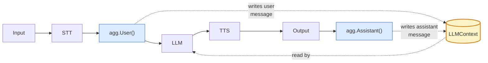
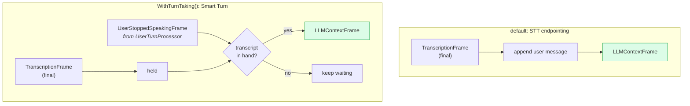
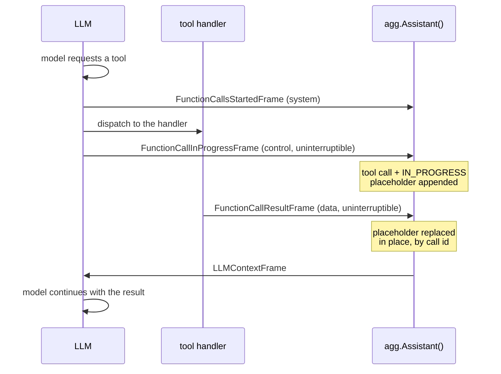

# LLM context

The conversation has to accumulate across turns, and something has to decide
*when* the LLM runs. Two pieces do this: `frames.LLMContext` holds the
conversation, and a pair of **aggregators** maintains it from both ends.

## LLMContext

```go
convo := frames.NewLLMContext("You are a helpful voice assistant.")
```

`LLMContext` is a system prompt plus the running list of messages. It is the one
deliberate exception to the frame ownership rules: it is **not a frame**, it is a
long-lived aggregate shared between the aggregators and the LLM service, and it
**is safe for concurrent use**.

```go
convo.AddUserMessage("What's the weather?")
convo.AddAssistantMessage("Sunny and 22 degrees.")
msgs := convo.Messages()          // a copy
n := convo.EstimatedTokens()

convo.SetSystem("You are terse.") // swap the prompt mid-conversation
convo.SetTools(tools)             // change advertised tools
convo.SetToolChoice(frames.ToolChoiceAuto)
```

A `Message` is a role plus text, and optionally tool calls or tool results:

```go
type Message struct {
    Role        Role        // RoleSystem | RoleUser | RoleAssistant | RoleDeveloper
    Text        string
    ToolCalls   []ToolCall  // on an assistant message that requested tools
    ToolResults []ToolResult
}
```

## The aggregator pair

```go
agg := aggregators.New(convo)

pipeline.New(t.Input(), stt, agg.User(), llm, tts, t.Output(), agg.Assistant())
```

One pair, one shared context, two processors at **different positions**:



**`agg.User()` goes before the LLM.** It collects `TranscriptionFrame`s into a
user message, appends it to the context, and emits an `LLMContextFrame`, which is
what actually triggers the LLM.

**`agg.Assistant()` goes at the very end, after the output transport.** It
collects the `TTSTextFrame`s the TTS service emits as it speaks, and appends them
as the assistant message. Positioning it last is deliberate: it records what the
bot *actually said*, so an interrupted response is stored truncated rather than
whole.

That last point is the one people get wrong. Put the assistant aggregator before
the output transport and the context will claim the bot finished sentences the
user never heard.

## When the LLM runs

Two modes, and the difference is worth understanding because it dominates how the
bot feels.



By default the turn ends when the STT provider finalizes a transcription. That is
simple and provider-dependent: endpointing tuned for dictation tends to cut in
while someone is still thinking.

With `aggregators.WithTurnTaking()`, the turn instead ends when the
`UserTurnProcessor` says so (a Smart Turn model looking at prosody, not just
silence), gated on a finalized transcript being available:

```go
agg := aggregators.New(convo, aggregators.WithTurnTaking())

pipeline.New(t.Input(), vadProc, stt, turnsProc,
    agg.User(), llm, tts, t.Output(), agg.Assistant())
```

The gate matters in both directions: end-of-turn without a transcript waits, and a
transcript without end-of-turn waits. See
**[Turn-taking](../guides/turn-taking.md)**.

## Changing the context at runtime

Mutating the shared `LLMContext` directly works, but the frames are usually
better: they are ordered against the rest of the pipeline, so the change lands at
a predictable point in the conversation rather than mid-turn.

| Frame | Effect |
|---|---|
| `LLMMessagesAppendFrame` | Append messages. |
| `LLMMessagesUpdateFrame` | Replace all messages. |
| `LLMSetToolsFrame` | Change the advertised tools. |
| `LLMSetToolChoiceFrame` | Change whether the model may or must call a tool (`ToolChoiceAuto`, `ToolChoiceNone`, `ToolChoiceRequired`). |
| `LLMRunFrame` | Run the current context now, without new user input. |

`LLMRunFrame` is how you make the bot speak first:

```go
task.QueueFrame(frames.NewLLMRunFrame())   // greet on connect
```

## Tool calls

A tool call round trip, in frames:



The call and the message answering it are appended **together**, the moment the
call starts, and the result replaces that placeholder where it sits rather than
being appended at the tail. That is what keeps the conversation valid at every
instant: no inference ever sees a tool call with nothing answering it, and a
result cannot be separated from its call by whatever was appended while the tool
ran. A call the user interrupts has its placeholder marked `CANCELLED` the same
way.

`FunctionCallResultFrame` is **uninterruptible**: a tool that already ran has
side effects, so its result must reach the context even if the user barged in
meanwhile. See [Interruptions](interruptions.md#surviving-an-interruption).

A tool registered with `llm.WithCancelOnInterruption(false)` is asynchronous: it
survives the barge-in and the model does not wait for it. Its results arrive as
`RoleDeveloper` messages appended when they are ready, since by then the
conversation has moved past where its placeholder sits.

## Long conversations

A voice conversation grows until it hits the model's context window. Two
mechanisms:

```go
n := convo.EstimatedTokens()   // cheap check

// Keep the 10 most recent messages; summarize everything older.
changed, err := convo.Compact(ctx, 10,
    func(ctx context.Context, prior string, dropped []frames.Message) (string, error) {
        return summarize(ctx, prior, dropped)   // your LLM call
    })
```

`Compact` cuts on a message boundary that keeps tool calls with their results, and
threads the previous summary in as `prior` so summaries fold into each other
rather than being rebuilt from nothing.

To have that happen automatically instead of on your own schedule, pass
`aggregators.WithSummarization(cfg)`:

```go
agg := aggregators.New(convo,
    aggregators.WithTurnTaking(),
    aggregators.WithSummarization(aggregators.SummarizeConfig{ /* … */ }),
)
```

`SetRecall` is the related hook for retrieval: it injects long-term memory
alongside the system prompt without touching the message list, which is how the
`mem0` integration in `examples/voicebot` works.

---

Back to **[Architecture](architecture.md)**, or on to
**[Writing a processor](../extending/custom-processor.md)**.
