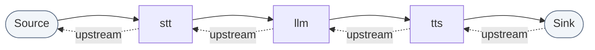
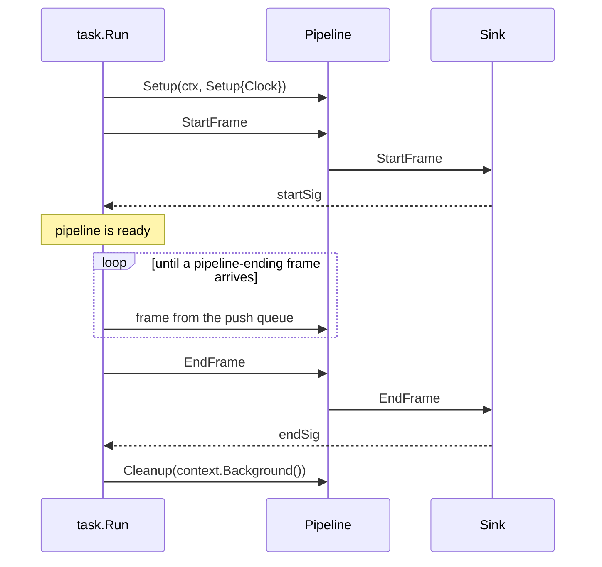
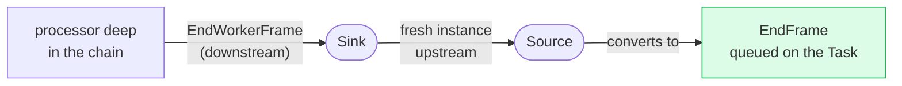

# Pipeline & Task

Three types, with a clean split of responsibility:

| Type | Responsibility |
|---|---|
| **`Pipeline`** | Links processors into a chain. Is itself a processor, so pipelines nest. |
| **`Task`** | Runs one pipeline for one session: sends `StartFrame`, injects frames, shuts down. |
| **`Runner`** | Runs a `Task` and ends it on an interrupt signal. |

## Pipeline

```go
p := pipeline.New(t.Input(), stt, agg.User(), llm, tts, t.Output(), agg.Assistant())
```

`New` links the processors in order and wraps them in a **source** and a **sink**
so frames can be fed in and observed at the edges:



Because a `Pipeline` is a `Processor`, it can be an element of another pipeline.
Two composites build on that:

- **`pipeline.NewParallel(branches ...[]processor.Processor)`**: fan a frame out
  to several branches and merge what comes back. Useful for running two services
  on the same audio.
- **`pipeline.NewServiceSwitcher(services, strategy)`**: route frames to exactly
  one of several services, switched at runtime by pushing a
  `SwitchServiceFrame`. Useful for swapping an LLM mid-conversation.

## Task

```go
task := pipeline.NewTask(pipeline.New(procs...), pipeline.TaskParams{
    AudioInSampleRate:  16000,   // default
    AudioOutSampleRate: 24000,   // default
    EnableMetrics:      true,
    EnableUsageMetrics: true,
})
err := task.Run(ctx)
```

`Run` blocks until the pipeline finishes. What it does:



Note the last step: cleanup runs on a **fresh context**, so a canceled `ctx` does
not abort goroutine shutdown.

`Run` returns only after an `EndFrame`, `StopFrame` or `CancelFrame` has traveled
the *whole* way through the pipeline, not merely been queued. That round trip is
what guarantees every processor has seen the shutdown.

### Driving a running task

```go
task.QueueFrame(frames.NewTTSSpeakFrame("Hi, how can I help?"))  // inject
task.QueueFrames([]frames.Frame{f1, f2})                          // in order

task.StopWhenDone()   // EndFrame: stop once queued frames flush
task.Cancel()         // CancelFrame: stop now
task.HasFinished()    // has Run returned?
```

`Flush` is the one that is easy to miss and often exactly what you want:

```go
if err := task.Flush(ctx); err != nil { /* ctx expired */ }
```

It queues a `PipelineFlushFrame` probe and blocks until the probe has traveled
down to the sink **and back up** to the source. When it returns, every frame
queued ahead of it has been processed. Use it to let the pipeline settle (after
an interruption, say) before injecting new work.

### Observing frames

```go
pipeline.TaskParams{
    OnReachedDownstream: func(f frames.Frame) { /* reached the sink */ },
    OnReachedUpstream:   func(f frames.Frame) { /* reached the source */ },
    Observers: []pipeline.Observer{
        observers.NewTurnTracking(observers.TurnTrackingConfig{}),
    },
}
```

Both callbacks and observers see frames only at the pipeline **edges**, not
between every pair of processors. Observers are notified after the callbacks. See
[Observability](../guides/observability.md).

## Worker frames: talking back to the Task

A processor deep in the chain sometimes needs to end the session: a voicemail
detector that decides to hang up, for instance. It cannot reach the `Task`
directly, so it pushes a **worker frame** and the `Task` converts it:



| Push this | Task queues | Effect |
|---|---|---|
| `EndWorkerFrame` | `EndFrame` | Graceful: queued frames flush first. |
| `StopWorkerFrame` | `StopFrame` | Stop, leave processors running. |
| `CancelWorkerFrame` | `CancelFrame` | Immediate, no flush. |
| `InterruptionWorkerFrame` | `InterruptionFrame` | Barge-in. |

Worker frames are pushed **downstream** by default so that frames already queued
ahead of them are processed first. On reaching the sink, a *fresh* instance is
sent back upstream, a new instance rather than the original, so the two
directions never share a frame.

## Runner

```go
runner := pipeline.NewRunner()
err := runner.Run(ctx, task)
```

Runs the task and cancels it on `SIGINT`/`SIGTERM`. For a server that runs one
task per connection, call `task.Run` directly and cancel on connection close,
which is what the examples do:

```go
ctx, cancel := context.WithCancel(context.Background())
go func() { <-conn.Done(); cancel() }()
task.Run(ctx)
```

---

Next: **[Interruptions](interruptions.md)**, the mechanism that makes barge-in
work.
