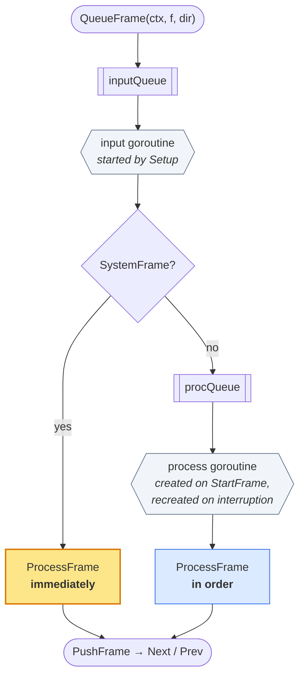
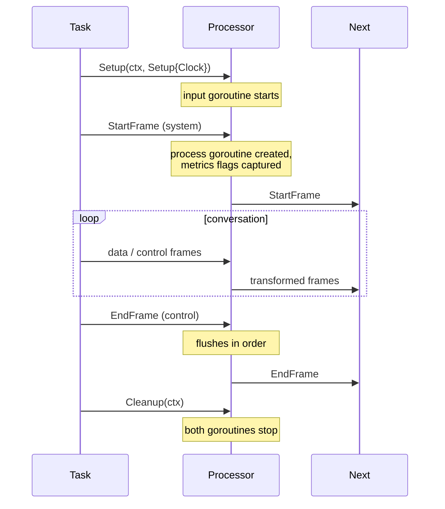

# Processors

A processor is a node in the chain. It receives frames, does something, and
pushes frames on. Every processor in jargo (a transport, an STT service, an
aggregator, a whole nested pipeline) is one of these.

Concrete processors embed `*processor.Base`, which supplies everything in the
[`Processor`](https://pkg.go.dev/github.com/gojargo/jargo/processor#Processor)
interface except the one method you write yourself:

```go
type Echo struct{ *processor.Base }

func NewEcho() *Echo {
    e := &Echo{}
    e.Base = processor.New("Echo", e)   // pass self, so Base can dispatch to your ProcessFrame
    return e
}

func (e *Echo) ProcessFrame(ctx context.Context, f frames.Frame, dir processor.Direction) error {
    if err := e.Base.ProcessFrame(ctx, f, dir); err != nil {  // always call the base first
        return err
    }
    return e.PushFrame(ctx, f, dir)
}
```

Two rules, and they matter:

1. **Pass `self` to `processor.New`.** That is how the base dispatches to *your*
   `ProcessFrame` instead of its own.
2. **Call `e.Base.ProcessFrame` first.** The base handles the lifecycle frames:
   `StartFrame`, `InterruptionFrame`, `CancelFrame`. Skip it and your processor
   never starts, and never responds to barge-in.

## Two goroutines per processor

This is the part that repays understanding. Every processor runs **two**
goroutines, and system frames are handled on a different one from data frames.



Why two? Because a system frame must be able to overtake a backlog. If the bot
has ten seconds of synthesized audio queued and the user interrupts, the
`InterruptionFrame` cannot wait behind that audio. It has to be handled *now*,
and its whole job is to throw that audio away.

Splitting the goroutines is what makes that possible. The input goroutine only
ever sorts frames; it never blocks on slow work. The process goroutine does the
slow, in-order work, and it is **cancelable and disposable**: an interruption
kills it and starts a fresh one.

### Consequences worth internalizing

- **Your `ProcessFrame` runs on two different goroutines** depending on the frame
  category. Guard any state it touches. The `Base` metrics flags are the model
  here: written once on the input goroutine before the process goroutine exists.
- **System frames are not ordered against data frames.** A `TranscriptionFrame`
  pushed before an `InterruptionFrame` may well be processed after it.
- **Blocking on a data frame does not block system frames.** This is the property
  that keeps barge-in responsive when a provider stalls.

### Direct mode

Routing processors (a `Pipeline` and its source and sink) do no real work and
would only add a goroutine hop per frame. `processor.WithDirectMode()` makes them
process inline on the caller's goroutine, with no queues and no goroutines:

```go
p.Base = processor.New("Pipeline", p, processor.WithDirectMode())
```

A direct-mode processor also ignores interruptions, since it holds nothing to
throw away.

## Lifecycle



`Setup` must be called before frames are queued, and `PushFrame` **drops frames
pushed before the `StartFrame` arrives** (and logs an error). If a processor
needs to emit something at startup, do it when handling the `StartFrame`, not in
`Setup`.

## Pushing frames

```go
b.PushFrame(ctx, f, processor.Downstream)  // toward output
b.PushFrame(ctx, f, processor.Upstream)    // toward input
```

`PushFrame` calls the neighbor's `QueueFrame`, which never blocks. There is no
backpressure between processors by design: an unbounded queue is what prevents
two processors that push to each other from deadlocking.

For errors, use the helper, which builds the frame, logs, and pushes upstream:

```go
b.PushError(ctx, "transcription failed", err, false)  // true = fatal, cancels the task
```

A `FatalErrorFrame` reaching the pipeline source cancels the task.

## Signalling in both directions

A processor that needs every other processor to hear something, in front of it
*and* behind it, must not push the same frame twice. Build one frame per
direction and pair them:

```go
down, up := build(), build()
down.Base().SetBroadcastSiblingID(up.ID())
up.Base().SetBroadcastSiblingID(down.ID())

_ = p.PushFrame(ctx, down, processor.Downstream)
_ = p.PushFrame(ctx, up, processor.Upstream)
```

Two reasons this is not just paranoia. The directions are processed on separate
goroutines, so a shared frame would be mutated concurrently. And a consumer that
sees both halves (an observer counting turns) can use the sibling id to
recognize the pair and report the event once instead of twice.

`processor/turns` broadcasts this way for `UserStartedSpeakingFrame`,
`UserStoppedSpeakingFrame` and `InterruptionFrame`.

## What ships in the box

| Package | Processor | Role |
|---|---|---|
| `processor/vadproc` | VAD | Silero voice-activity detection. |
| `processor/turns` | `UserTurnProcessor` | Turn-taking decisions, barge-in, idle watchdog. |
| `processor/aggregators` | `User` / `Assistant` | Build the conversation context. |
| `processor/rtvi` | RTVI | Bridges pipeline events to an RTVI client. |
| `processor/audiobuffer` | Audio buffer | Records the conversation. |
| `processor/dtmf` | DTMF | Telephony keypress handling and aggregation. |
| `processor/ivr` | IVR | IVR navigation. |
| `processor/voicemail` | Voicemail | Voicemail detection. |
| `processor/langchain` | LangChain | LangChain-backed LLM bridge. |
| `processor` | `FunctionFilter` | Drop or allow frames by predicate, per direction. |

Transports and services are processors too: `t.Input()`, `t.Output()`, and every
STT/LLM/TTS from `provider/`.

---

Next: **[Pipeline & Task](pipeline.md)**, on how processors get linked and driven.
See **[Writing a processor](../extending/custom-processor.md)** to build your own.
