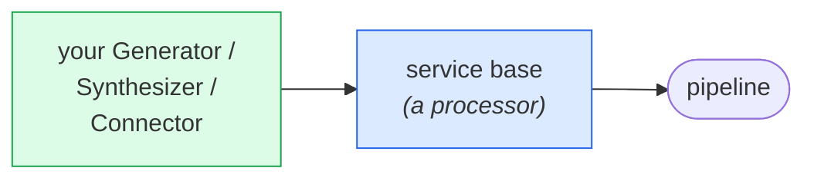

# Writing a service

Adding an STT, LLM or TTS provider means implementing a small interface, usually
one method, and letting the shared base handle the pipeline side: frames,
metrics, tracing, interruption, and the tool loop.

You do **not** write a processor for this. The base is the processor.

## The pattern



Follow the repository conventions: a plain `Config` struct validated with
`go-playground/validator` tags, no environment variables, no functional options.

## An LLM

Implement one method:

```go
type Generator interface {
    Generate(ctx context.Context, convo *frames.LLMContext, emit Emit) error
}
```

```go
package myllm

type Config struct {
    APIKey string `validate:"required"`
    Model  string
}

type Service struct {
    *llm.Base
    cfg Config
}

func NewLLM(cfg Config) *Service {
    if cfg.Model == "" {
        cfg.Model = "my-default-model"
    }
    s := &Service{cfg: cfg}
    s.Base = llm.New("MyLLM", s)
    s.SetModel(cfg.Model)     // reported as a span attribute
    return s
}

func (s *Service) Generate(ctx context.Context, convo *frames.LLMContext, emit llm.Emit) error {
    stream, err := s.startStream(ctx, convo.Messages())
    if err != nil {
        return err
    }
    defer stream.Close()

    for {
        select {
        case <-ctx.Done():
            return ctx.Err()      // interruption: stop immediately
        default:
        }

        delta, err := stream.Recv()
        if errors.Is(err, io.EOF) {
            return nil
        }
        if err != nil {
            return err
        }
        if err := emit(delta); err != nil {
            return err
        }
    }
}
```

`llm.Base` wraps that in `LLMFullResponseStartFrame` / `LLMTextFrame`s /
`LLMFullResponseEndFrame`, records TTFB and token usage, and opens the span.

**Honoring `ctx` is not optional.** Cancellation *is* the interruption mechanism:
ignore it and every barge-in stalls up to three seconds. Check it in the loop, and
pass it to your HTTP or WebSocket calls.

### Tool calling

Additionally implement `ToolGenerator`:

```go
type ToolGenerator interface {
    GenerateWithTools(ctx context.Context, convo *frames.LLMContext, sink Sink) error
}
```

Stream text to `sink.Text` and each requested call to `sink.Tool`. Return when the
model's turn completes. `llm.Base` runs the whole tool loop (dispatching handlers,
emitting the call frames, feeding results back) as long as the context carries
tools and your service implements this.

For a server-sent-events provider, `service/llm/sse.go` already handles the SSE
framing.

## A TTS service

```go
type Synthesizer interface {
    SampleRate() int
    Synthesize(ctx context.Context, text string, emit func(pcm []byte) error) error
}
```

```go
func (s *Service) SampleRate() int { return s.cfg.SampleRate }

func (s *Service) Synthesize(ctx context.Context, text string, emit func([]byte) error) error {
    resp, err := s.post(ctx, text)
    if err != nil {
        return err
    }
    defer resp.Body.Close()

    buf := make([]byte, 4096)
    for {
        n, err := resp.Body.Read(buf)
        if n > 0 {
            if err := emit(buf[:n]); err != nil {   // emit as it arrives
                return err
            }
        }
        if errors.Is(err, io.EOF) {
            return nil
        }
        if err != nil {
            return err
        }
    }
}
```

Emit PCM **as it arrives**. Buffering the whole utterance before the first `emit`
adds its full synthesis time to perceived latency. It is the single most common
mistake in a TTS integration.

`tts.Base` handles chunking, the `TTSStartedFrame` / `TTSStoppedFrame` bracket,
`TTSAudioRawFrame`s, and TTFA measured from the first *audible* sample.

### Word timings

If your provider returns them, implement `WordTimestamps` as well. This is what
aligns `TTSTextFrame`s to the audio actually spoken, and therefore what lets an
interrupted response be recorded truncated instead of whole. Worth doing when the
API supports it.

## An STT service

Streaming, for conversation:

```go
type Connector interface {
    Connect(ctx context.Context, sampleRate int) (Stream, error)
}

type Stream interface {
    Send(audio []byte) error
    Recv() ([]Result, error)
    Close() error
}
```

```go
func NewSTT(cfg Config) *stt.StreamService {
    return stt.NewStream("MySTT", &connector{cfg: cfg}, cfg.SampleRate)
}
```

`stt.StreamService` turns that into a processor: `Send` gets the audio, and each
`Result` becomes an `InterimTranscriptionFrame` or a `TranscriptionFrame`
depending on its final flag. `service/stt/wsutil` helps with WebSocket providers.

Mark interim results honestly. Reporting partials as final makes the bot answer
half-sentences.

For a provider with no streaming API, implement `Transcriber` and build it with
`stt.NewSegment(name, transcriber, sampleRate)` instead, accepting that there will
be no interim transcriptions.

## Metadata

Implement `Describer` to announce useful facts at pipeline start:

```go
func (s *Service) Metadata() stt.Metadata {
    return stt.Metadata{TTFSP99Latency: 300 * time.Millisecond}
}
```

`STTMetadataFrame` carries this, and the turn-taking strategies use the p99
finalize latency to decide how long to wait for a transcript before giving up.
Supplying a real number measurably improves turn-taking; omitting it falls back to
a default.

## Checklist

- [ ] `Config` struct with `validate` tags; no env vars, no options.
- [ ] Defaults applied in the constructor for empty fields.
- [ ] `ctx` honored everywhere, including inside network calls.
- [ ] Output streamed incrementally, not buffered whole.
- [ ] `SetModel` called, so traces attribute correctly.
- [ ] Errors returned, not swallowed; the base converts them to `ErrorFrame`s.
- [ ] A test against a fake server; see the existing `provider/*/­*_test.go`.

## Contributing it

Providers live in `provider/<name>`. Commits follow Conventional Commits, and
`golangci-lint run` must be clean. See
[`AGENTS.md`](../../AGENTS.md) for the full conventions.

A provider that comes with a test against a recorded or faked response is much
easier to accept than one that needs live credentials to exercise.
