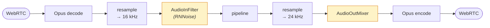

# Audio

Everything between the network and the models: codecs, sample rates, denoising and
mixing.

## The path



The shaded stages are optional and off by default.

## Sample rates

Two rates, set in both the transport params and the task params:

```go
params := transport.DefaultParams()
params.AudioInSampleRate = opus.SampleRate    // 48 kHz over WebRTC
params.AudioOutSampleRate = opus.SampleRate

task := pipeline.NewWorker(pipe, pipeline.WorkerConfig{
	Params: pipeline.Params{
	    AudioInSampleRate:  opus.SampleRate,
	    AudioOutSampleRate: opus.SampleRate,
	},
})
```

Task defaults are **16000 in / 24000 out**, chosen because STT models want 16 kHz
and TTS output is commonly 24 kHz. Over WebRTC you generally want both at
`opus.SampleRate` (48 kHz) and let the services resample internally, which avoids
a double conversion.

The `StartFrame` carries these rates down the pipeline, which is how every
processor learns them. Set them on the `pipeline.Params`, not by mutating frames.

## Codecs

| Package | Default | Optional |
|---|---|---|
| `audio/opus` | Pure-Go decode + SILK encode | C libopus with `-tags libopus` (better speech quality) |
| `audio/resample` | Pure-Go [go-resample](https://github.com/gojargo/go-resample) | libsoxr with `-tags libsoxr` (highest quality) |
| `audio/g711` | µ-law / A-law for telephony | n/a |

The pure-Go defaults are what keep `CGO_ENABLED=0` working. Reach for the C
backends only when you have measured that quality matters for your use case.

## Noise reduction

RNNoise, loaded at run time through purego:

```go
if filter, err := rnnoise.New(); err != nil {
    slog.Warn("noise reduction unavailable", "err", err)
} else {
    params.AudioInFilter = filter
}
```

Treat the error as "run without it" rather than fatal, so the bot works on
machines that do not have the library. `AudioInFilter` takes any `audio.Filter`,
so a custom one (gain, a high-pass, your own model) drops in the same way.

Denoising helps in genuinely noisy rooms and can hurt otherwise: it removes
information the VAD uses. Measure before shipping it.

## Background audio

An output mixer loops a background track under the bot's speech: hold music,
ambience, or comfort noise so a silent line does not sound dead:

```go
params.AudioOutMixer = myMixer   // audio.Mixer
```

Drive it at runtime with control frames:

```go
task.QueueFrame(frames.NewMixerEnableFrame(true))
task.QueueFrame(frames.NewMixerUpdateSettingsFrame(map[string]any{"volume": 0.2}))
```

Both are **control** frames, so a mixer change is ordered against the audio around
it rather than landing mid-sentence.

## VAD and turn detection

`audio/vad` (Silero) and `audio/turn` (Smart Turn v3) are the analyzers;
`processor/vadproc` and `processor/turns` are the processors that run them. Both
models are embedded in the binary and need only the ONNX Runtime at run time.

See **[Turn-taking](turn-taking.md)**.

## Recording

`processor/audiobuffer` captures the conversation, started and stopped by frames:

```go
task.QueueFrame(frames.NewAudioBufferStartRecordingFrame())
...
task.QueueFrame(frames.NewAudioBufferStopRecordingFrame())
```

Recording a call usually has legal consequences. Get consent, and be aware the
buffer holds audio in memory.

## Other pieces

- **`audio/onset`**: finds the first audible sample in a PCM stream, so
  time-to-first-audio metrics measure real speech rather than leading silence.
- **`audio/chain.go`**: composes several `audio.Filter`s into one.
