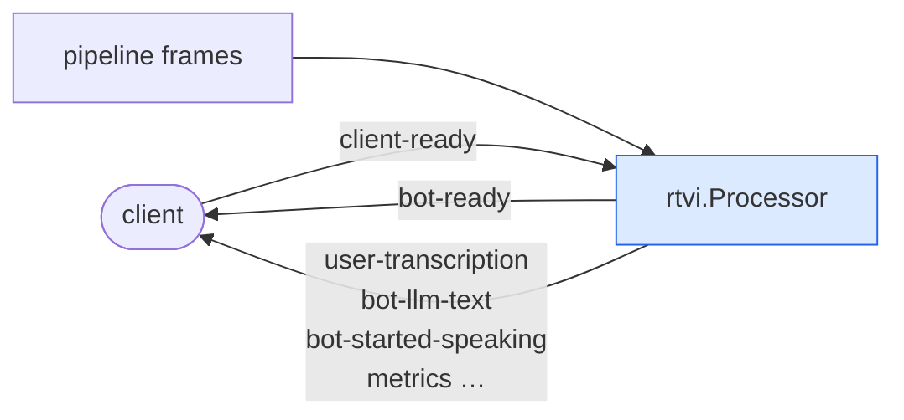

# RTVI

Audio is only half of what a client needs. A usable UI also wants transcriptions
as they arrive, who is speaking right now, and when the bot is thinking. RTVI
(Real-Time Voice Interface) is the JSON protocol that carries those events over the
WebRTC data channel.

Because it is an open protocol with existing web, iOS and Android client SDKs, a
jargo server works with clients you did not write.

## Adding it

One processor, placed **upstream of the output transport**, which is what
actually carries the messages to the client:

```go
pipeline.New(
    t.Input(), vadProc, stt, turnsProc,
    agg.User(), llm, tts,
    rtvi.NewProcessor(),   // <- here
    t.Output(), agg.Assistant(),
)
```

That is the whole integration. The processor watches frames going past and
translates the interesting ones into client messages.

## What it does



Incoming client messages arrive as `InputTransportMessageFrame`s; outgoing ones
are pushed downstream as `OutputTransportMessageUrgentFrame`s. **Urgent**, so a
transcription reaches the UI ahead of queued audio instead of lagging behind the
speech it describes.

## The messages

Every message is `{"label":"rtvi-ai","type":…,"id":…,"data":…}`. The processor
speaks protocol version `2.0.0`.

| Type | Meaning |
|---|---|
| `client-ready` → `bot-ready` | The handshake. |
| `user-transcription` | What the user said (interim and final). |
| `bot-transcription` | What the bot said. |
| `bot-llm-text` / `bot-tts-text` | Streamed response text, per stage. |
| `user-started-speaking` / `user-stopped-speaking` | Turn boundaries. |
| `bot-started-speaking` / `bot-stopped-speaking` | Bot speech boundaries. |
| `bot-llm-started` / `bot-llm-stopped` | Model is generating. |
| `bot-tts-started` / `bot-tts-stopped` | Speech is being synthesized. |
| `llm-function-call-in-progress` / `llm-function-call-result` | Tool activity. |
| `metrics` | TTFB, processing time, token usage. |
| `send-text` | Client sends text instead of speech. |
| `error` | Something failed. |

The constants live in `processor/rtvi` (`rtvi.TypeUserTranscription` and so on),
so you do not hand-write the strings.

## Clients

For the browser, use the client packages in
[jargo-client-react](https://github.com/gojargo/jargo-client-react). The
`nextjs-voicebot` example there talks to any of the `examples/voice/<provider>`
backends:

```sh
go run ./examples/voice/openai                        # backend on :8080
NEXT_PUBLIC_JARGO_URL=http://localhost:8080 npm run dev   # client
```

The per-provider examples are **headless**: they expose the `/offer` endpoint and
no UI, so a client is required. `examples/echo` and `examples/voicebot` serve
their own minimal page and need nothing extra.

## Without RTVI

The processor is optional. Leave it out and you still have working audio. You
just have no event stream, so the UI cannot show live transcriptions or speaking
state. Phone transports have no data channel at all, which is why
[`examples/twiliobot`](../../examples/twiliobot) omits it.

To send your own application messages instead, push an
`OutputTransportMessageFrame` (ordered with the audio) or an
`OutputTransportMessageUrgentFrame` (ahead of it), and read
`InputTransportMessageFrame` for what the client sends back.
